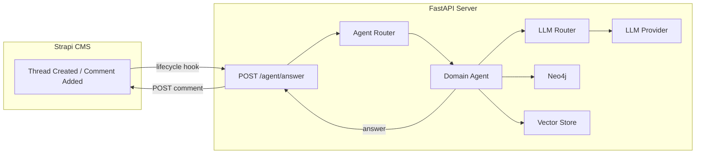

# System Patterns

## Architecture Overview

## Key Design Patterns

### 1. Agent Pattern
- **Base Agent**: Abstract base class for all domain agents
- **Domain Agents**: Specialized implementations for different domains
  - Market Agent
  - Tool Agent
  - General Agent
- **Agent Router**: Factory pattern for agent selection

### 2. LLM Router Pattern
- Model selection based on task and cost
- Provider abstraction for different LLM services
- Prompt management system

### 3. Hybrid Search Pattern
- Vector Store: Semantic search capabilities
- Neo4j: Graph-based relationship storage
- Combined retrieval strategy

### 4. Security Patterns
- API Key Authentication
- Domain Whitelisting
- Rate Limiting
- Dependency Injection for validation

## Component Relationships

### FastAPI Components
1. **Routes**
   - `/agent/answer`: Main endpoint for thread responses
   - `/article/summarize`: Article processing endpoint
   - `/article/store`: Article storage endpoint

2. **Dependencies**
   - API key validation
   - Domain validation
   - Database connections

### Data Storage
1. **Neo4j**
   - Thread relationships
   - User interactions
   - Knowledge graph

2. **Vector Store**
   - Document embeddings
   - Semantic search
   - Article chunks

### Integration Points
1. **Strapi Integration**
   - Lifecycle hooks
   - API key validation
   - Comment posting

2. **LLM Integration**
   - Provider abstraction
   - Model selection
   - Prompt management 